# deploiement-AntoineRocq

Application full stack **API Node.js + PostgreSQL**, conteneurisée avec Docker et déployée sur une VM Azure via un pipeline CI/CD GitHub Actions + Kubernetes (Minikube).

---

## Stack technique

| Composant | Technologie |
|-----------|-------------|
| API | Node.js + Express |
| Base de données | PostgreSQL 16 |
| Conteneurisation | Docker + Docker Compose |
| Orchestration | Kubernetes (Minikube) |
| CI/CD | GitHub Actions |
| Cloud | Microsoft Azure — VM `arocq-deploy` |
| Registry | Docker Hub |

---

## Architecture du pipeline

```
git push (main)
      ↓
GitHub Actions
      ↓
 1. Installation des dépendances (npm ci)
      ↓
 2. Tests Jest (échec = pipeline arrêté)
      ↓
 3. Build Docker multi-stage
      ↓
 4. Push image → Docker Hub
      ↓
 5. Déploiement SSH sur VM Azure
      ↓
 6. kubectl apply → mise à jour Kubernetes
```

---

## Lancer en local

### Prérequis
- Docker Desktop
- Node.js 20+

### Étapes

```bash
git clone https://github.com/Caotox/deploiement-AntoineRocq.git
cd deploiement-AntoineRocq
cp .env.example .env
docker-compose up --build
```

L'API est accessible sur `http://localhost:3001/health`

---

## Endpoints

| Méthode | Route | Description |
|---------|-------|-------------|
| GET | `/health` | Statut API + DB |
| GET | `/users` | Liste des utilisateurs |
| POST | `/users` | Créer un utilisateur |

---

## Structure du projet

```
.
├── api/
│   ├── src/
│   │   ├── index.js          # API Express
│   │   └── index.test.js     # Tests Jest
│   ├── Dockerfile          
│   ├── .dockerignore
│   └── package.json
├── k8s/
│   ├── api-deployment.yaml
│   ├── postgres-deployment.yaml
│   ├── configmap.yaml
│   └── secret.yaml
├── .github/
│   └── workflows/
│       └── cicd.yml          # Pipeline CI/CD
├── docker-compose.yml
├── .env.example
└── README.md
```

---

## Preuves de réalisation

### Github créé et fonctionnel
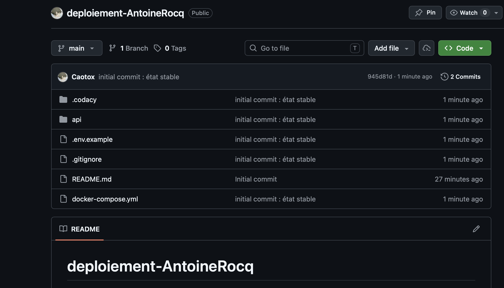

### Tests Jest 
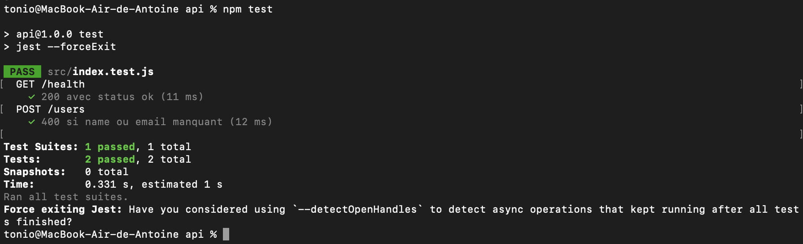

### Docker Compose en local
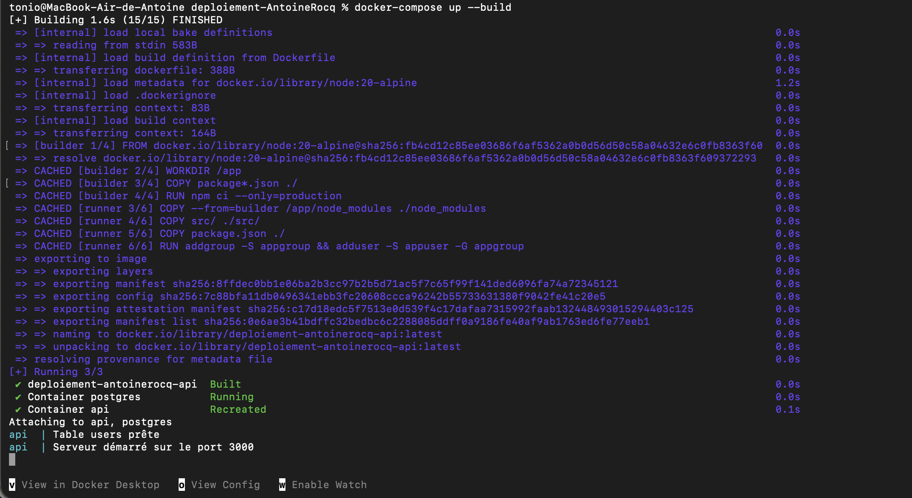

### Curl /health en local
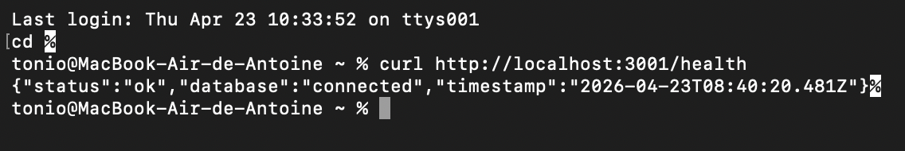

### VM Azure créée 
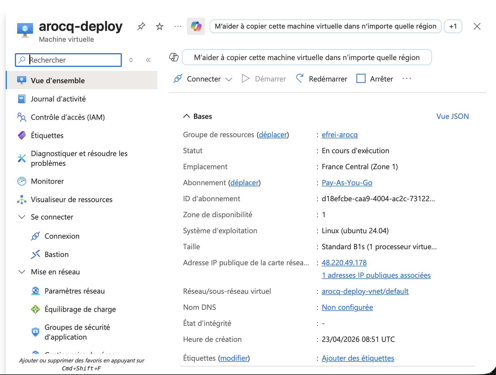

### Règles réseau Azure 
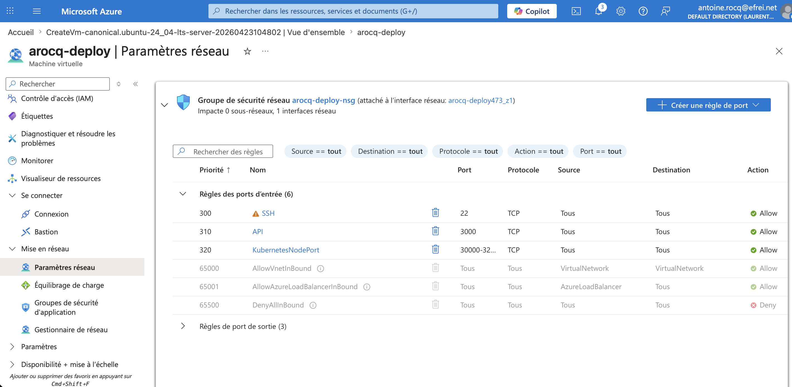

### Connexion SSH à la VM
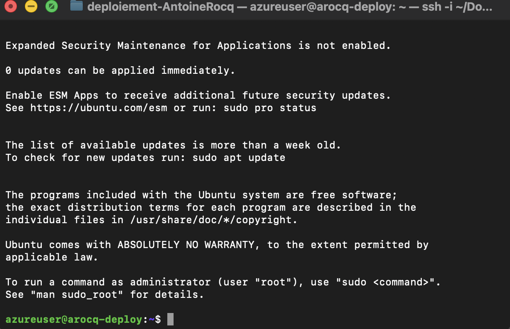

### Docker installé sur la VM
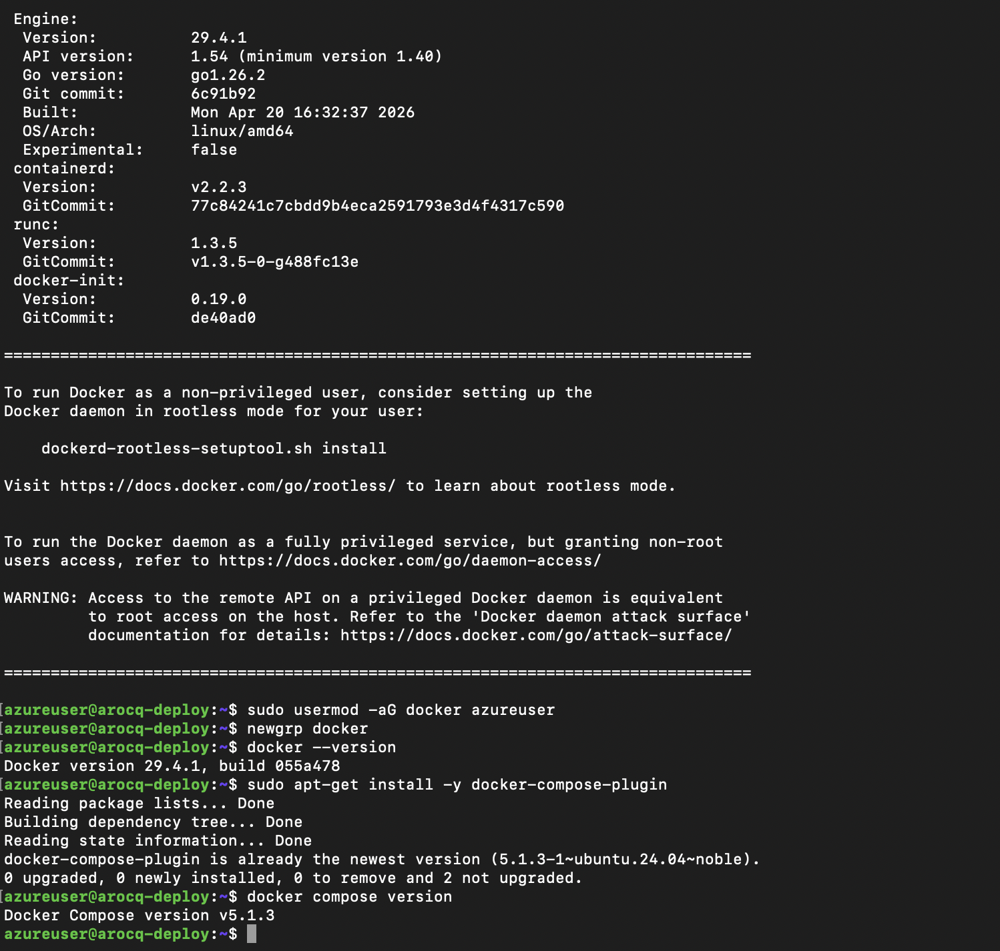

### Minikube opérationnel 
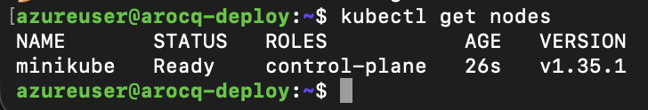

### Fichiers K8s sur GitHub
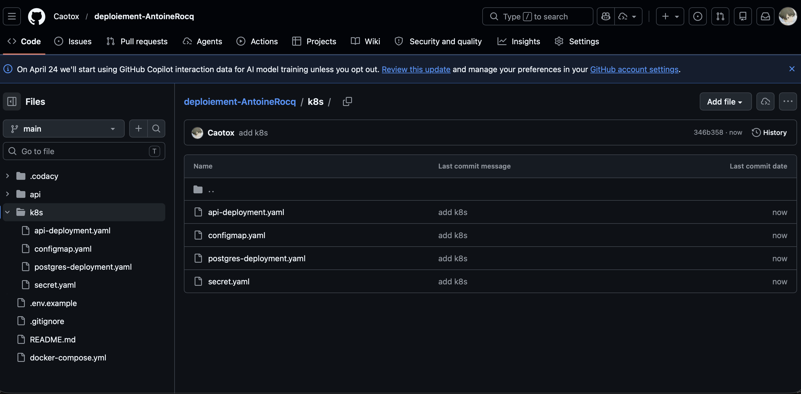

### Communication entre machine locale et VM pour transmission de fichiers
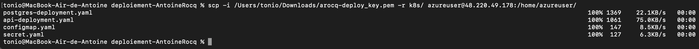

### kubectl apply + kubectl get pods 
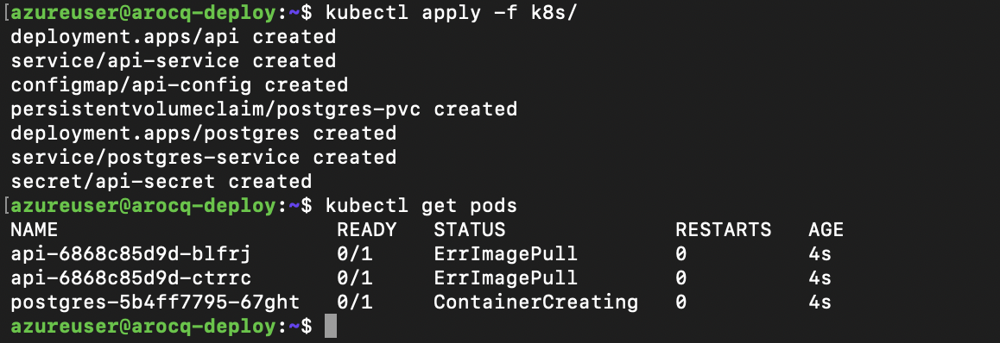

### kubectl get pods + services
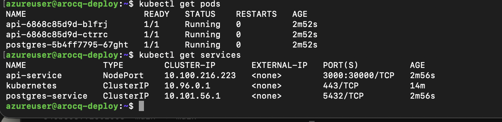

### Secrets GitHub Actions configurés
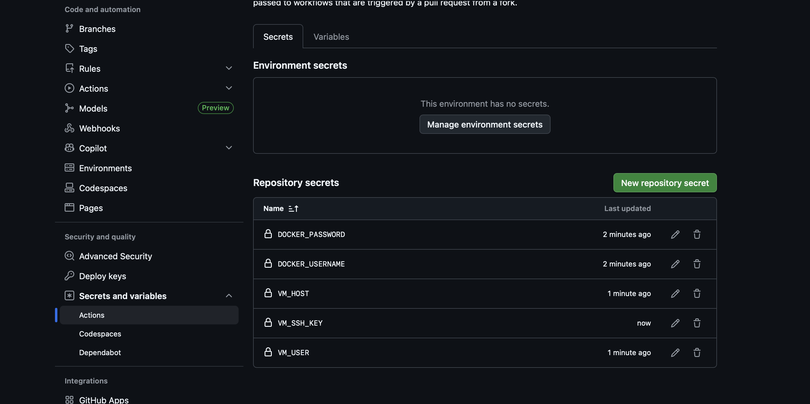

### Pipeline GitHub Actions — 3 jobs en vert 
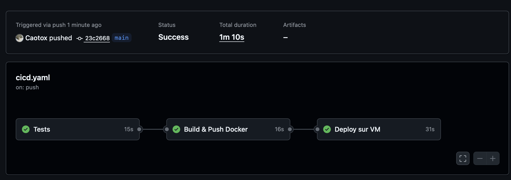

### Curl Kubernetes
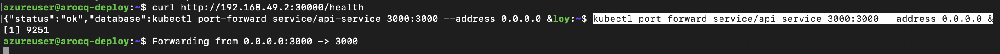

### Curl /health depuis la VM
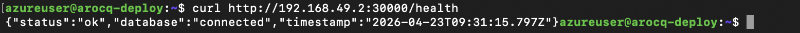


### Curl /health depuis le Mac 
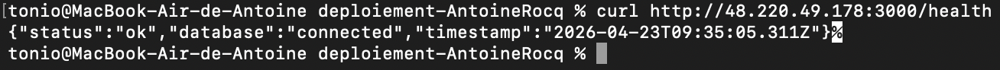

### API accessible dans le navigateur
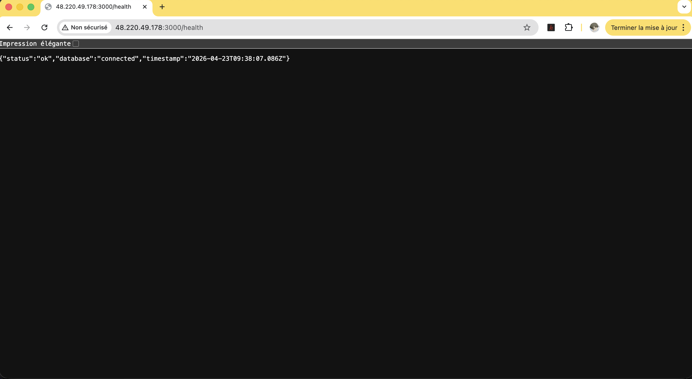

---

## Gestion des secrets

Aucun secret n'est commité dans le code.

---

## Difficultés rencontrées

J'ai rencontré un premier problème avec une inaccessibilité du Port 3000 qui était déjà utilisé par un autre service Docker. J'ai donc modifié le Dockerfile pour distribuer sur le port 3001 (d'où l'accessibilité de l'API/health sur le port 3001).

J'ai également rencontré un problème avec Kubernetes qui nécessite 2 CPU pour fonctionner. Cela m'a demandé d'arrêter ma VM afin de réaliser un redimenssionement, pour avoir accès à 2 CPU (forfait B2s), après quoi Kubernetes a fonctionné correctement.

Enfin, j'ai recontré d'autres problèmes telles qu'un problème de communication de mes secrets Github et de leur accès depuis la VM, ou encore des problèmes d'accès à l'image Docker par Kubernetes, tous deux réglés assez rapidement avec des corrections isolées (variables incorrectes, mauvais chemins...) plus que de véritables décisions techniques. 